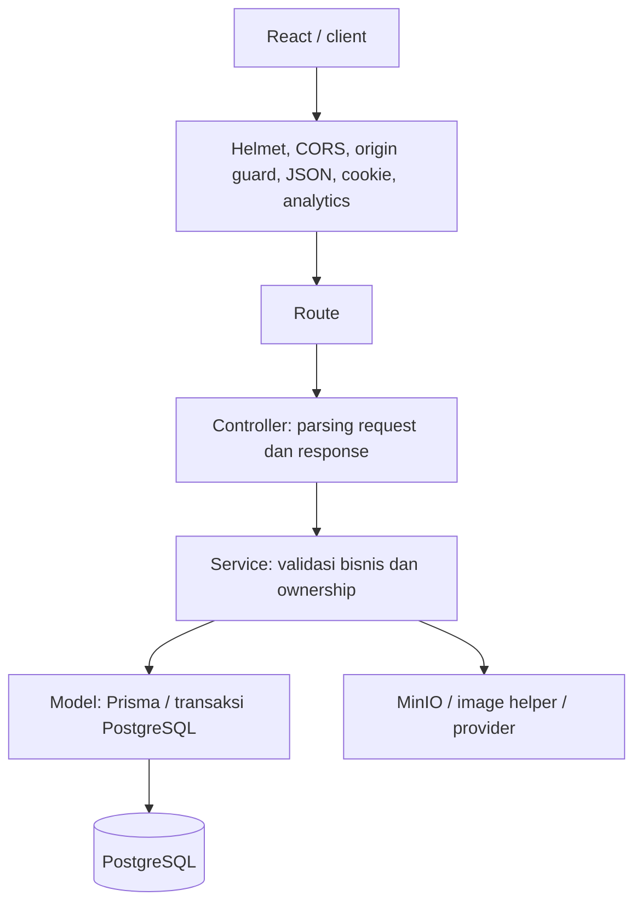
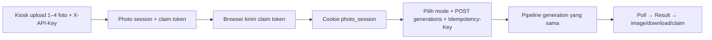

# Flow backend Express dan fungsi API

Snapshot inspeksi: 10 Oktober 2026. Dokumen ini mengikuti source workspace saat ini dan runtime yang diperiksa, termasuk perubahan lokal yang belum di-commit. Daftar API merupakan pemetaan source, bukan bukti bahwa setiap endpoint telah diuji di production.

## Runtime yang aktif

| Komponen | Entry point / fungsi |
| --- | --- |
| HTTP API | `src/migration-server.ts` → `createMigrationApp()` di `src/migration-app.ts` |
| Dependency wiring | `src/migration-container.ts`: database, catalog, account, upload, result, generation, provider, admin, kiosk |
| Worker | `src/migration-worker.ts`: loop customer generation dan loop preview admin |
| PostgreSQL + Prisma | Metadata, kepemilikan, job, Result, claim, kredit, lease dan dispatch generation |
| Redis | Rate-limit store; tersedia juga sebagai pilihan backend queue |
| MinIO / filesystem | Binary upload, hasil, dan asset; database menyimpan referensinya |
| Python image helper | Normalisasi upload, persiapan gambar/print, validasi input BASIC, dan compositor CLASSIC |
| AI provider abstraction | `NativeAIProvider`; implementasi terkonfigurasi saat inspeksi adalah NineRouter |

Container aktif menjalankan `dist/migration-server.js` dan `dist/migration-worker.js`. `src/server.ts` / `src/worker.ts` merupakan entry point upstream berbeda; README historisnya tidak boleh dijadikan kontrak runtime native. Prefix `/api/v1` di runtime native adalah adapter kiosk, bukan seluruh API upstream lama.

API diakses melalui proxy frontend. Port Express 8081 berada di jaringan container dan tidak dipublikasikan langsung ke localhost host.

## Alur request dan generation



```mermaid
sequenceDiagram
    participant U as Frontend
    participant A as Express API
    participant H as Python image helper
    participant D as PostgreSQL
    participant O as Storage
    participant W as Worker
    participant P as AI provider
    U->>A: GET catalog + account/usage
    U->>A: POST /api/uploads (multipart file)
    A->>H: Decode, validasi, normalisasi JPEG
    A->>O: Simpan foto
    A->>D: Simpan metadata + account_id/guest_id
    A-->>U: 201 upload_id + preview_url
    U->>A: POST /api/generations + Idempotency-Key
    A->>D: Cek ownership, seleksi, snapshot, kredit; buat QUEUED
    A->>D: Enqueue dispatch PostgreSQL (runtime saat inspeksi)
    A-->>U: 202 job_id + state
    W->>D: Ambil dispatch; claim job + lease
    W->>D: PROCESSING
    alt CLASSIC
        W->>H: Komposisi capture + frame/layout
    else BASIC
        W->>H: Siapkan identity + template
        W->>P: Edit template memakai foto referensi
    else ADVANCED
        W->>P: Generate dari foto + experience/frame style
        W->>H: Siapkan output print master
    end
    W->>O: Validasi dan simpan PNG hasil
    W->>D: Buat Result, COMPLETED, settlement kredit
    U->>A: GET /api/generations/:id (polling)
    A-->>U: state + credit_charge + result_id jika dapat diakses
    U->>A: GET /api/results/:id/image atau /download
    A->>O: Baca hasil milik user
    A-->>U: Binary gambar
```

### Perilaku penting

- Identitas customer berasal dari cookie account `photobooth_session` atau guest `photobooth_guest`. Controller dapat membuat guest baru. Ownership tetap diperiksa untuk upload, job, dan Result; mengetahui ID saja tidak memberi akses.
- Upload memakai field multipart `file`. Python menormalisasi ke JPEG, lalu API menyimpan metadata, hash, expiry dan referensi file. Upload expired ditolak dengan `UPLOAD_EXPIRED`.
- Generation membekukan konfigurasi engine saat request. BASIC membekukan referensi template, hash, dimensi, prompt dan model; CLASSIC membekukan layout; ADVANCED membekukan prompt/model. Prompt/model ditentukan server.
- State: `QUEUED → PROCESSING → COMPLETED` atau `FAILED`. Recovery lease dapat mengambil ulang job setelah worker terhenti; jumlah percobaan dibatasi konfigurasi.
- Worker memvalidasi PNG dengan decoding pixel. CLASSIC harus 1200×3600, ADVANCED 2160×3240, BASIC mengikuti canvas template.
- `Idempotency-Key` pada customer bersifat opsional; adapter kiosk mewajibkannya. Key sama + payload sama mengembalikan job yang sama; payload berbeda menghasilkan `409 IDEMPOTENCY_CONFLICT`.
- Gagal enqueue menghasilkan `QUEUE_UNAVAILABLE`; job ditandai gagal dan accounting diselesaikan sebagai kegagalan. Worker gagal juga menjalankan settlement/refund. Jika commit penyelesaian ambigu, worker meminta reconciliation dan tidak langsung melakukan refund yang bertentangan.
- Billing web terbaru dilakukan setelah hasil berhasil: CLASSIC 1 kredit; AI dihitung dari penggunaan token atau estimasi yang didukung konfigurasi. Jika billing belum `PAID`, polling menyembunyikan Result; status charge bisa `NEEDS_TOP_UP` atau `PENDING_USAGE`. Status job `COMPLETED` saja belum menjamin hasil dapat dibuka. Kiosk native memiliki jalur reservasi berbeda: CLASSIC tidak mereservasi kredit AI, BASIC/ADVANCED memakai reservasi kiosk.
- Sebelum membuat job web, saldo minimal CLASSIC 1 kredit dan AI 10 kredit; pemeriksaan ini belum memotong saldo. Job aktif lain untuk identitas yang sama ditolak dengan `GENERATION_IN_PROGRESS`. Tagihan AI account yang masih tertunda juga dapat memblokir request AI berikutnya.
- Worker juga menjalankan cleanup upload/hasil dan recovery job customer/preview. Expiry, deletion dan claim diperiksa oleh service Result.
- Provider yang tidak tersedia menghasilkan `AI_PROVIDER_NOT_CONNECTED`; tidak ada gambar sukses pengganti. Checkout pembayaran masih mengembalikan `503 PAYMENT_GATEWAY_UNAVAILABLE`.

## API customer web

Prefix seluruh tabel berikut: `/api`. Response sukses native berupa objek JSON langsung, kecuali endpoint gambar/download berupa binary. Gunakan `credentials: 'include'` agar cookie terkirim.

### Catalog (publik)

| Method | Path | Fungsi |
| --- | --- | --- |
| GET | `/templates` | Daftar template BASIC yang tersedia |
| GET | `/templates/:id/preview` | Gambar preview template |
| GET | `/experiences` | Daftar experience ADVANCED yang dipublikasikan |
| GET | `/experiences/:id/thumbnail` | Thumbnail experience |
| GET | `/classic/layouts` | Daftar layout CLASSIC, capture count dan metadata |
| GET | `/classic/layouts/:id/preview` | Preview frame/layout CLASSIC |
| GET | `/advanced/frame-styles` | Daftar frame style ADVANCED |
| GET | `/advanced/ornaments` | Daftar ornament dan konfigurasi kompatibilitas |

### Account

| Method | Path | Fungsi / input |
| --- | --- | --- |
| GET | `/account/usage` | Usage dan hak/kredit identitas account atau guest |
| GET | `/account/me` | Identitas sesi aktif |
| GET | `/account/center` | Data Account Center; akses sesuai identitas |
| POST | `/account/signup` | Registrasi; `{email, password}`; set cookie; `201` |
| POST | `/account/login` | Login password; `{email, password}`; set cookie |
| POST | `/account/google` | Verifikasi Google `{id_token}`; set cookie account |
| POST | `/account/logout` | Revoke sesi aktif dan hapus cookie |
| PATCH | `/account/profile` | Ubah `{display_name}` untuk account |
| POST | `/account/sessions/revoke-all` | Cabut seluruh sesi account |
| POST | `/account/sessions/:id/revoke` | Cabut sesi tertentu; hapus cookie jika sesi aktif |
| POST | `/account/topups/checkout` | Validasi account + `{credits}`; saat ini selalu `503 PAYMENT_GATEWAY_UNAVAILABLE`, tidak menambah saldo |

### Upload, generation dan hasil

| Method | Path | Fungsi / akses |
| --- | --- | --- |
| POST | `/uploads` | Multipart `file`; normalisasi dan simpan upload milik account/guest; `201` |
| GET | `/uploads/:id` | Metadata upload milik user, termasuk expiry |
| GET | `/uploads/:id/preview` | Binary JPEG upload milik user |
| POST | `/generations` | Validasi pilihan, buat/enqueue job; `202` |
| GET | `/generations/:id` | Poll state, error, billing dan referensi hasil milik user |
| GET | `/results/:id` | Metadata Result milik user |
| GET | `/results/:id/image` | Binary gambar Result |
| GET | `/results/:id/download` | Download master; `?rendition=print` meminta print rendition bila didukung |
| DELETE | `/results/:id` | Hapus hasil milik user; body `{confirm:true}` |
| POST | `/results/:id/claim` | Buat/reuse/refresh link berbagi hasil; body opsional `{reuse_token, refresh, kiosk}` |
| GET | `/public/results/:token` | Metadata hasil melalui token claim valid |
| GET | `/public/results/:token/image` | Binary gambar melalui token claim valid |
| GET | `/public/results/:token/download` | Download melalui token; mendukung `rendition=master\|print` |
| POST | `/kiosk/session` | Buat/rotasi cookie run kiosk; `?new_run=true`; tidak memberikan izin masuk kiosk web |

Link claim memungkinkan browser lain membuka hasil melalui token sampai batas aksesnya; endpoint public tetap memeriksa token, expiry dan rate limit. Claim Result berbeda dari claim photo-session kiosk.

### Body generation web

```json
{"upload_id":"UPLOAD_ID","mode":"BASIC","template_id":"TEMPLATE_ID"}
```

```json
{"upload_id":"UPLOAD_ID","mode":"ADVANCED","experience_id":"EXPERIENCE_ID","frame_style_id":"natural","ornament_ids":[]}
```

```json
{"upload_id":"CAPTURE_1","mode":"CLASSIC","layout_id":"LAYOUT_ID","capture_upload_ids":["CAPTURE_1","CAPTURE_2"]}
```

CLASSIC memerlukan urutan capture unik sesuai jumlah shot layout; `upload_id` harus capture pertama. `event_name` dan `captured_at` hanya untuk `classic-floral-event-001`; nama event wajib pada layout tersebut di web. Layout event personalisasi itu ditolak pada jalur kiosk native. Body bersifat strict: field pilihan mode lain ditolak.

## Kiosk web terbatas

| Method | Path | Fungsi |
| --- | --- | --- |
| POST | `/api/kiosk/login/google` | Verifikasi Google dan account yang diizinkan; set cookie account + bukti izin kiosk |
| POST | `/api/kiosk/logout` | Logout dan hapus bukti izin kiosk |
| GET | `/api/kiosk/access` | Periksa account serta bukti login Google untuk masuk kiosk |

Customer routers dipasang ulang di `/api/kiosk/web`: catalog, uploads, generations, results/public results, kiosk session, serta account di `/api/kiosk/web/account`. Semuanya melewati guard kiosk terlebih dahulu. Cookie run kiosk berbeda dari cookie izin masuk `photobooth_kiosk_access`.

## Kiosk native / upload → claim → browser

Prefix: `/api/v1`. Route tersedia jika `NATIVE_KIOSK_ENABLED`. JSON sukses dibungkus `{data: ...}`; image/download tetap binary.



| Method | Path | Fungsi / akses |
| --- | --- | --- |
| POST | `/photo-sessions`, `/upload-image` | Multipart `image` 1–4 file; autentikasi `X-API-Key`; buat session; `201` |
| POST | `/photo-sessions/:code/claim` | Claim token; set cookie `photo_session` untuk `/api/v1` |
| GET | `/photo-sessions/:code` | Info session milik browser yang sudah claim |
| GET | `/photos/:id` | Binary foto dengan ownership session |
| GET | `/image/:id` | Metadata foto; berbeda dari endpoint binary `/photos/:id` |
| GET | `/photos/:id/url` | URL delivery foto: signed MinIO bila aktif, atau fallback API |
| POST | `/generations` | Adapter seleksi kiosk ke pipeline customer; Idempotency-Key wajib; `202` |
| GET | `/generations/:id` | Status job milik session |
| GET | `/photo-sessions/:code/generations` | Riwayat generation session |
| GET | `/frames` | Layout CLASSIC tanpa kebutuhan nama event |
| GET | `/frames/:id`, `/frame/:id` | Detail frame/layout yang tersedia |
| GET | `/templates`, `/experiences`, `/frame-styles`, `/ornaments` | Catalog mode kiosk |
| GET | `/results/:id` | Metadata hasil dengan URL adapter kiosk |
| GET | `/results/:id/image`, `/results/:id/download` | Binary hasil; download memberi attachment; `rendition=print` bila didukung |
| GET | `/results/:id/url` | Signed URL hasil atau fallback API |
| POST | `/results/:id/claim` | Claim berbagi hasil; `{refresh, reuse_token}` opsional |

Body generation kiosk memakai camelCase: `sessionCode`, `mode`, opsional `photoIds`, serta `frameId` (layout CLASSIC), `templateId` (BASIC), `experienceId`, `frameStyleId`, `ornamentIds` (ADVANCED). Jika `photoIds` tidak diberikan, CLASSIC memakai seluruh capture session dan AI memakai foto pertama. Contoh BASIC:

```json
{"sessionCode":"SESSION_CODE","mode":"BASIC","templateId":"TEMPLATE_ID"}
```

`NativeKioskService.generate()` memetakan body ini ke input customer snake_case. Kiosk session membatasi foto, masa akses, kuota dan pilihan event.

## Admin

Prefix: `/api/admin`. Controller memeriksa cookie admin atau `X-Admin-Token` serta role (`content_manager`, `operator`, `superadmin`) per aksi. Upload asset memakai multipart field `file`. Tabel ini mengelompokkan method yang tersedia pada path terkait.

| Method | Path | Fungsi |
| --- | --- | --- |
| POST / POST / GET | `/login`, `/logout`, `/me` | Login admin, logout, identitas/role |
| GET, POST | `/experiences`, `/templates` | List dan buat catalog |
| PATCH, DELETE | `/experiences/:id`, `/templates/:id` | Update/hapus item catalog |
| POST | `/experiences/publish-ready` | Publish item siap; `{confirm:true}` |
| GET, POST, DELETE | `/experiences/:id/thumbnail`, `/templates/:id/preview` | Baca/ganti/hapus preview |
| GET, POST | `/templates/:id/image` | Baca/ganti gambar master template |
| GET, POST | `/classic-layouts` | List/buat layout CLASSIC |
| PATCH, DELETE | `/classic-layouts/:id` | Update/nonaktifkan layout |
| POST | `/classic-layouts/:id/frame` | Ganti asset frame |
| GET, POST | `/advanced/:kind` | List/buat preset frame style atau ornament |
| PATCH | `/advanced/:kind/:id` | Update preset |
| GET | `/preview-sources` | Daftar sumber foto preview |
| POST / GET | `/preview-sources/:id`, `/preview-sources/:id/image` | Ganti sumber / baca gambar sumber |
| POST | `/experiences/:id/preview` | Enqueue generation preview admin; `202` |
| POST | `/preview-jobs/generate-missing` | Enqueue batch preview; `{confirm:true, source_id?}` |
| GET | `/preview-jobs/:id` | Poll status preview admin |
| GET | `/overview`, `/users`, `/users/:id` | Ringkasan operasional dan data user |
| GET, POST | `/users/:id/credits` | Riwayat/adjust kredit |
| GET | `/users/:id/generations`, `/users/:id/sessions`, `/users/:id/audit` | Job, sesi dan audit user |
| POST | `/users/:id/sessions/revoke` | Cabut sesi user |
| PATCH | `/users/:id/status` | Ubah status user |
| POST | `/users/:id/subscription` | Kelola subscription user |
| GET | `/credits/ledger`, `/subscriptions` | Ledger kredit dan subscription |
| GET, POST | `/plans` | List/buat plan; pembuatan untuk superadmin |
| PATCH | `/plans/:id` | Update plan; superadmin |
| GET | `/generations`, `/generations/:id` | List/detail generation operasional |
| POST | `/result-claims/:id/revoke` | Revoke link claim |
| GET | `/audit`, `/settings` | Audit dan konfigurasi aman untuk admin |
| GET, POST / PATCH | `/admin-users`, `/admin-users/:id` | List/buat / update admin; superadmin |
| GET | `/usage/overview`, `/usage/users`, `/usage/users/:id` | Dashboard usage dan detail user |
| GET | `/usage/users/:id/credits`, `/usage/users/:id/generations` | Kredit dan generation pada dashboard usage |
| GET | `/usage/generations`, `/usage/generations/:id` | Usage generation dan detail biaya/provider |
| GET | `/usage/generations/:id/result/image`, `/usage/generations/:id/result/download` | Preview/download foto hasil untuk operator |
| DELETE | `/usage/generations/:id/result` | Hapus foto hasil; `{confirm:true}` |
| GET | `/usage/providers/overview`, `/usage/providers/accounts` | Ringkasan pemakaian provider dan account provider |

Preview admin memiliki queue/loop terpisah dari job customer. Mutasi admin mengikuti service catalog/operations/usage dan pencatatan audit yang diterapkan masing-masing service.

## Health, error dan hasil validasi

| Endpoint / respons | Arti |
| --- | --- |
| `GET /health` | Liveness proses Express; bukan pemeriksaan seluruh dependency |
| `GET /api/health` | Database, Redis, storage, dispatch queue, dan konfigurasi provider |
| Error bisnis native | Umumnya `{detail:{error_code,message}}`; asset tertentu memakai string detail |
| Invalid request | Zod `422`; JSON invalid `400`; ukuran upload/body berlebih `413` |
| Route tidak tersedia | `404 {detail:"Not Found"}` |
| Internal error | `500 {error_code:"INTERNAL_ERROR",message:...}` |

Validasi read-only pada 10 Oktober 2026:

- `docker inspect` mengonfirmasi entry point native untuk API/worker.
- `curl -sS http://127.0.0.1:3000/api/health`: `status=ok`; database, Redis, storage dan queue `ok`; `queue_backend=postgres`.
- Health melaporkan provider terkonfigurasi, tetapi fungsi `available()` bukan request AI sungguhan dan tidak membuktikan kualitas hasil atau akses provider secara end-to-end.
- Mapping method/path diperiksa dari `migration-app.ts`, semua native route modules, controller, dan service terkait. Tidak melakukan generation berbayar, mutasi data, restart, migrasi atau deployment.

Rujukan source relatif dari folder ini: `../src/migration-app.ts`, `../src/migration-container.ts`, `../src/routes/`, `../src/controllers/`, `../src/services/customer-generation.service.ts`, `../src/services/native-generation-runner.service.ts`, `../src/services/customer-generation-worker.service.ts`, dan `../src/models/customer-generation.model.ts`.
