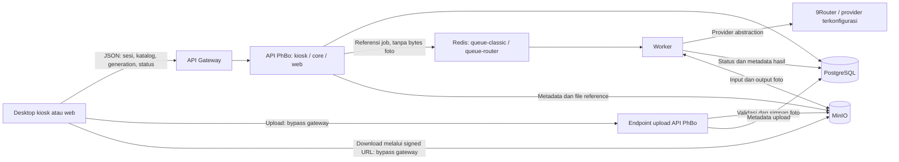

# Arsitektur API gateway dan jalur foto PhBo

Status: KANDIDAT TAHAP 2 (2026-10-07), mengikuti diagram yang diunggah pengguna di [arsi phbo.jpeg](<arsi phbo.jpeg>) dan penjelasan bahwa gateway menangani request selain upload/download foto. Dokumen ini memperjelas target dan selisih source. Implementasi gateway kiosk kandidat dan split session/upload tersedia; deployment production belum diubah. Lihat [kontrak, pengujian dan promotion](../api-gateway/README.md).

## Baseline teknologi untuk review (2026-10-07)

Rekomendasi gateway adalah **NGINX OSS** sebagai proses/container kontrol khusus dengan konfigurasi routing, batas body JSON, rate limit, timeout, request ID dan log yang meredaksi akses sensitif. Auth/ownership bisnis tetap diperiksa API PhBo; gateway tidak menggantikan validasi media. Implementasi kandidat NGINX tersedia untuk allowlist kiosk `/api/v1`; domain web/core/admin belum dipetakan dan deployment live belum berubah.

NGINX web yang sekarang ada di `frontend/nginx.conf` masih meneruskan request API dan multipart upload melalui proses yang sama. Target membutuhkan jalur media yang melewati entrypoint/proses berbeda dari gateway kontrol; sekadar membuat `location /media` pada proses gateway yang sama tidak memenuhi pemisahan bytes pengguna. Domain, TLS, endpoint storage dan kapasitas diputuskan sebelum deployment, tanpa mengubah reverse proxy proyek lain.

Source/runtime baseline: API Express, PostgreSQL untuk dispatch job, Redis untuk rate limit, worker dan MinIO existing. Pemeriksaan `/api/health` pada 2026-10-07 melaporkan dependency `ok` dan queue backend `postgres`; ini belum uji generation atau load gateway. Redis `queue-classic`/`queue-router` tetap target diagram dalam tahap migrasi terpisah.

Printer berada di PC Windows melalui adapter driver/spooler lintas merek. Epson L8050 menjadi profil pertama; Canon/model lain dapat memakai profil tervalidasi sendiri. Pemilihan printer tidak mengubah gateway atau server generation. Format baseline dan acceptance fisik berada di [planning desktop](DESKTOP_KIOSK_PLAN.md).

## Arah arsitektur dari pengguna

Komponen dalam diagram: API Gateway -> API PhBo -> database dan Redis (`queue-classic`, `queue-router`) -> worker -> 9Router. API PhBo dan worker mengakses MinIO. Worker memperbarui status pekerjaan di database.

API PhBo dibagi berdasarkan domain:

- `kiosk/`: request desktop kiosk dan sesi event.
- `core/`: kemampuan bersama seperti login, generation, templates, dan operasi metadata storage.
- `web/`: kemampuan khusus web seperti gallery dan profile.
- `kiosk/session/{sessionCode}/upload`: jalur upload foto kiosk yang tertulis dalam diagram.

Pembagian domain tersebut tidak mengharuskan tiga microservice. Rencana awal mempertahankan satu API PhBo dengan modul route/controller/service yang jelas, serta satu entrypoint gateway untuk request kontrol. Memecah proses/server memerlukan kebutuhan dan keputusan terpisah.

## Dua jalur request



Diagram ini memperjelas jalur media dari penjelasan pengguna, bukan bukti semua koneksi telah tersedia. Endpoint upload adalah bagian API PhBo yang diakses lewat jalur media tersendiri; bukan akses langsung ke database/worker. Bentuk URL/domain diputuskan saat desain deployment.

| Request | Lewat gateway? | Tujuan |
| --- | --- | --- |
| Login, akses sesi, konfigurasi event, izin mode | Ya | API PhBo, respons JSON |
| Daftar template/frame/experience | Ya untuk metadata | API PhBo; bytes thumbnail/preview di jalur media |
| Buat generation, cek status, metadata hasil | Ya | API PhBo; job async |
| Minta otorisasi upload/download atau signed URL | Ya | API PhBo; JSON kecil |
| Upload foto JPEG/PNG dan file gambar lain | Tidak | Endpoint media API PhBo yang memvalidasi file |
| Download hasil, preview foto, thumbnail, print file | Tidak | Signed MinIO URL atau endpoint media terotorisasi |
| USB camera/live view lokal dan submit printer Windows | Tidak | Adapter desktop lokal |

Gateway tidak menerima multipart foto, bytes gambar, foto base64 dalam JSON, atau stream download. Request `GET /results/:id` untuk metadata berbeda dari `GET /results/:id/image` untuk bytes. File preview tetap media meski ukurannya kecil.

## Upload target awal: langsung ke endpoint media API PhBo

1. Trusted backend-client desktop meminta/membuat sesi melalui gateway. Server menetapkan ownership, izin event, dan operation/session ID.
2. Desktop memperoleh izin upload yang scoped pada kiosk/sesi/event. Mekanisme token/grant disepakati dalam kontrak, bukan menaruh secret di React.
3. Desktop mengirim bytes foto ke jalur media API PhBo, tanpa melalui gateway. Route target dari diagram adalah `kiosk/session/{sessionCode}/upload`.
4. Endpoint media memvalidasi akses, quota/limits, MIME dari isi, ukuran/dimensi, kemampuan decode, orientasi, dan jumlah shot. File disimpan ke MinIO; PostgreSQL menyimpan metadata/reference saja.
5. Respons upload mengembalikan ID foto, status validasi dan metadata. Setelah foto `VALIDATED`, desktop meminta generation melalui gateway menggunakan ID tersebut.

Bypass gateway mengurangi trafik file di gateway, tetapi API upload tetap mengeluarkan bandwidth/CPU/memori. Batas request, concurrency, timeouts, normalisasi gambar dan streaming/buffering perlu diuji pada jalur media. Tidak menjanjikan throughput tanpa pengukuran.

Source saat review masih menggunakan multipart upload bersama create session dan `multer.memoryStorage()`. Jangan menggambarkannya sebagai streaming upload yang sudah ada.

### Alternatif lanjutan: upload langsung ke MinIO

Presigned upload adalah opsi lanjutan jika diperlukan untuk mengurangi beban transfer API PhBo juga. Belum dipilih pengguna dan belum ditemukan pada adapter storage yang diperiksa; tidak menjadi asumsi MVP.

Jika dipilih: API mengalokasikan upload ID/object key -> memberi presigned upload melalui gateway -> desktop upload ke staging MinIO -> desktop mengirim completion metadata melalui gateway -> server/worker memverifikasi object dan decode -> baru upload menjadi valid. Completion tidak mempercayai klaim client tentang ukuran/hash/validitas; source object harus stabil selama validasi/pemrosesan. Generation dilarang membaca upload pending atau object milik sesi lain.

Kebutuhannya meliputi metode signing, expiry, pembatasan object/ukuran, checksum yang diverifikasi, cleanup orphan, idempotency, dan perlindungan overwrite setelah validasi. Jangan memberikan credential MinIO permanen atau menjadikan bucket publik.

## Download target

1. Desktop meminta metadata result atau URL download melalui gateway.
2. API memeriksa ownership/session/expiry, lalu menghasilkan signed GET URL berumur terbatas untuk object yang tepat.
3. Desktop mengunduh bytes langsung dari endpoint HTTPS storage, tanpa melalui gateway.
4. Result di-cache lokal dan diverifikasi sebelum print. URL expired diperbarui melalui gateway; tidak menjalankan ulang generation.

Source `native-object-storage.service.ts` sudah menyediakan `presignedGetObject`. Catatan `NATIVE_KIOSK_RELEASE.md` menyebut signed MinIO delivery aktif pada release terdahulu; health runtime 2026-10-07 sudah diperiksa, tetapi akses signed URL dan generation end-to-end belum diuji ulang pada tahap dokumen ini.

Rendition cetak yang saat ini dibuat melalui API dapat memakai jalur media langsung sementara. Untuk hasil cetak yang disimpan di MinIO, API mengembalikan metadata/signature setelah file tersedia. Tidak membuat PNG cetak besar pada request gateway. Desktop juga dapat menyusun master menjadi print file lokal sesuai planning kiosk.

## Tanggung jawab gateway, API dan worker

| Komponen | Tanggung jawab | Batas |
| --- | --- | --- |
| Gateway | Routing control request, pemeriksaan akses awal, request ID, rate limit kontrol, timeout dan ukuran JSON | Tidak menampung foto atau memindahkan validasi bisnis ke gateway |
| API PhBo | Ownership, event/catalog policy, validasi selection/upload, idempotency, quota, persist job/result, signed access | Tidak menunggu AI selesai pada request create generation |
| Endpoint media | Otorisasi file, file validation, batas bytes/concurrency dan transfer ke/dari storage | Tidak mengandalkan guard gateway karena jalurnya bypass |
| Redis target | Dispatch job menurut kelas pekerjaan | Payload job ID/reference, tanpa foto/base64 atau secret provider |
| Worker | Ambil input, jalankan engine/provider, simpan result, update DB, retries/recovery | Tidak menganggap delivery queue exactly-once |
| MinIO | Private object storage input/output | Tidak menjadi sumber ownership bisnis; console/admin credential tidak tersedia ke client |
| PostgreSQL | Metadata, ownership, job state, idempotency/quota ledger | Tanpa binaries image |

Gateway tidak otomatis retry mutation generation/upload. API dan desktop menggunakan idempotency yang disepakati. Trace memakai correlation ID lintas gateway, API, job dan media; log tidak berisi foto, token, atau query signature URL.

Worker mengakses 9Router melalui provider abstraction yang sudah ada. Provider/model/prompt bukan pilihan pelanggan. Kegagalan provider tetap dilaporkan sebagai error nyata.

## Struktur modul server target

```text
api-gateway/                    # Config NGINX OSS kandidat tersedia
  routing/                     # kiosk/core/web control only
  access/                      # Auth policy dan rate limit kontrol
  observability/               # Request ID, redacted logs

backend-express/src/
  routes/                      # Domain kiosk/core/web; URL lama dipetakan
  controllers/                 # Parse schema dan response
  services/
    kiosk-session/             # Create/read/reset sesi dan izin event
    media-upload/              # Jalur media langsung + upload operation
    media-delivery/            # Metadata, signing, media fallback
    generation/                # Validasi, quota, persist/enqueue
    catalog/                   # Shared metadata dan asset reference
  models/                      # Mapping metadata PostgreSQL existing
  queue/                       # Target classic/router adapters setelah keputusan
```

Struktur adalah pembagian tanggung jawab, bukan instruksi memindahkan semua source sekaligus. Desktop `backend-client` dipisah menjadi control client lewat gateway dan media client untuk transfer file. UI memakai satu bridge lokal; URL routing/credential tidak menjadi konfigurasi pelanggan.

## Selisih target dengan kondisi repo

| Area | Source/catatan release yang ditemukan | Target diagram dan pekerjaan |
| --- | --- | --- |
| Gateway | Proxy web live masih gabungan; kandidat dua proses NGINX sudah tersedia | Uji/promotion URL dan TLS; mapping web/core/admin tersendiri |
| Domain route | `/api` web/shared dan `/api/v1` native kiosk | Susun mapping `kiosk/core/web`; jangan menghapus URL existing tanpa compatibility plan |
| Session/upload | Endpoint gabungan legacy tetap ada; kandidat menambah `/api/v1/kiosk/sessions` dan `/api/v1/kiosk/session/:code/upload` | Kontrak idempotent diuji pada kandidat; migration/deployment live pending |
| Signed media | Signed GET MinIO sudah ada | Gunakan untuk bypass download; presigned upload masih opsi baru |
| Queue | Catatan release 2026-10-04: PostgreSQL dispatch; Redis untuk rate limits | Diagram menargetkan Redis `queue-classic` dan `queue-router`; perlu sprint/keputusan migrasi terpisah |
| Job states | `QUEUED`, `PROCESSING`, `COMPLETED`, `FAILED` | Label Pending/Success/Failed pada diagram dipetakan ke state existing; jangan ubah enum diam-diam |

Queue PostgreSQL yang aktif tidak diganti ketika menambah gateway. Rencana perpindahan ke Redis, bila disetujui untuk implementasi, harus menetapkan durable enqueue/reconciliation, lease/recovery, duplicate execution guards, retry limit, dan drain/cutover. Tidak membuat dua worker backend queue mengambil job yang sama tanpa koordinasi.

## Urutan pekerjaan dan validasi

1. Review URL mapping, ownership desktop/web, target queue, dan jalur upload. NGINX OSS menjadi rekomendasi teknologi; domain/TLS dan URL publik belum ditetapkan.
2. Definisikan kontrak create session kontrol, izin upload, upload media idempotent, metadata/signing, serta compatibility route lama.
3. Implementasikan dan uji jalur media terotorisasi sebelum routing desktop ke gateway; buktikan file tidak melewati gateway.
4. Tambahkan gateway control route tanpa mengubah worker/queue pada sprint yang sama.
5. Hubungkan control/media clients desktop dan jalankan upload -> generation -> signed result -> print nyata di Windows.
6. Jika diminta, lakukan queue migration dalam sprint tersendiri; uji drain/recovery/cutover tanpa double credit/result.

Acceptance gateway: request session/catalog/generation/status tercatat di gateway; upload/download image berhasil dengan bytes tidak melewati proses gateway; izin lintas sesi ditolak; batas file berlaku di media endpoint; expired URL dapat diperbarui; retry tidak menggandakan job/session; gateway tetap responsif ketika transfer media berlangsung pada concurrency yang disepakati. Verifikasi dari routing/log/network bytes dan uji end-to-end, bukan HTTP 200 saja.

## Status review

Implementasi kandidat gateway kiosk dan split session/upload sudah tersedia dengan pengujian DB/HTTP terisolasi. Domain/TLS public, promotion production, mapping web/core/admin, uji MinIO nyata, presigned upload dan migrasi Redis queue belum dilakukan. Endpoint legacy tetap kompatibel. Status pengujian serta batas recovery dijelaskan pada README gateway; tidak menyatakan desktop siap event.

## Update deployment 2026-10-07

Gateway kontrol/media native sudah live dengan binding `0.0.0.0:20251/20252` sesuai origin IP LAN pada tunnel pengguna. Endpoint reserve/upload idempotent dan signed download MinIO di hostname storage baru lulus smoke test. Lihat [laporan deployment](GATEWAY_DEPLOYMENT.md). Catatan kandidat/historis di atas tidak menyatakan uji hardware atau kapasitas event selesai.
